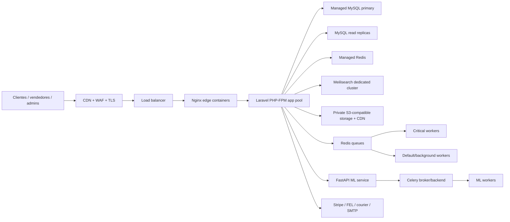

# Atlantia Production Infrastructure

This document defines the production target for Atlantia Supermarket. The goal is a secure, horizontally scalable deployment where application containers are disposable and state lives in managed or dedicated services.

## Target Topology

## Required Production Principles

- All app, worker, scheduler and ML containers must be stateless. No database, queue, session, cache or uploaded file state should be stored in container layers.
- MySQL, Redis, object storage and search must be managed services or dedicated stateful nodes with backups, monitoring and restricted private networking.
- TLS terminates at Cloudflare/CDN or the load balancer. The Laravel containers must receive correct `X-Forwarded-Proto` only from trusted proxies.
- Secrets must come from `/opt/atlantia/shared/*.env` on a locked host or from a secret manager. Real secrets must never live in Git.
- Migrations are a release step, not something every app replica runs automatically.
- Scheduler must run as one active replica only.
- Workers scale independently by queue priority.

## Compose Files

`docker-compose.prod.yml` is now a production baseline:

- `app`: Laravel PHP-FPM runtime.
- `nginx`: local edge/reverse proxy for PHP-FPM.
- `worker-critical`: checkout/payment/critical queue worker.
- `worker-default`: mail/notifications/ML/reports/default queue worker.
- `scheduler`: one scheduler loop.
- `ml-api`: FastAPI inference API.
- `ml-worker`: Celery worker.
- `mysql`, `redis`, `meilisearch`: disabled by default under the `stateful-local` profile for staging or emergency single-node use.

For real production, do not run the `stateful-local` profile except as a temporary fallback.

## Required Environment Files

Create these files on the production host or map them from your secret manager:

- `/opt/atlantia/shared/marketplace.env`
- `/opt/atlantia/shared/ml.env`
- `/opt/atlantia/shared/mysql.env` only when using the local-stateful profile
- `/opt/atlantia/shared/redis.env` only when using the local-stateful profile

Use these templates:

- `.env.production.example`
- `ml-service/.env.production.example`

Minimum production overrides:

- `APP_ENV=production`
- `APP_DEBUG=false`
- `APP_KEY` generated and rotated with `APP_PREVIOUS_KEYS` when needed
- `APP_URL=https://...`
- `TRUSTED_PROXIES` set to the private load balancer/CDN ranges only
- `SESSION_SECURE_COOKIE=true`
- `SESSION_DRIVER=redis`
- `CACHE_STORE=redis`
- `QUEUE_CONNECTION=redis`
- `FILESYSTEM_DISK=s3`
- real webhook secrets for payment, FEL, courier and ML

## Network Security

- Expose only the load balancer or reverse proxy to the internet.
- Keep PHP-FPM, MySQL, Redis, Meilisearch and ML on private networks.
- Bind local compose ports to `127.0.0.1` unless a load balancer is in front.
- Restrict Redis and MySQL security groups to application subnets.
- Enable MySQL TLS where supported and set `MYSQL_ATTR_SSL_CA`.
- Use Cloudflare/WAF rules for login, checkout, webhooks and upload endpoints.

## Data Security

- Use S3-compatible storage for public catalog media and private documents.
- Vendor applications, DPI, NIT, bank proofs and transfer evidence must be private objects, never public `/storage` assets.
- Enable object versioning and lifecycle rules.
- Use CDN only for public media. Private documents should be served through signed, authorized application routes.
- Back up MySQL with point-in-time recovery.
- Back up object storage metadata and media lifecycle policies.

## Scaling Model

Initial production:

- 2 app replicas
- 2 Nginx replicas or one managed load balancer plus app pool
- 1 scheduler
- 2 critical workers
- 2 default workers
- 1 ML API replica
- 1 ML worker
- Managed MySQL with automated backups
- Managed Redis with persistence
- Meilisearch on a dedicated node
- S3/CDN for assets

Growth path toward 1M registered customers:

- Add app replicas behind the load balancer.
- Split queues by workload: `critical`, `checkout`, `payments`, `mail`, `notifications`, `ml`, `reports`.
- Add read replicas for catalog/admin/reporting reads.
- Move heavy reports and PDF generation to background workers.
- Put Meilisearch behind private networking and size it independently.
- Cache catalog/search responses in Redis/CDN.
- Use CDN for all public images and static assets.
- Add autoscaling based on CPU, request latency, queue depth and Redis memory.
- Partition or archive audit logs, ML prediction logs, sessions and old carts before they become unbounded hot tables.

## Release Procedure

1. Build immutable images for the same Git commit:
   - `${REGISTRY_IMAGE}/marketplace:${APP_IMAGE_TAG}`
   - `${REGISTRY_IMAGE}/ml-api:${APP_IMAGE_TAG}`
   - `${REGISTRY_IMAGE}/ml-worker:${APP_IMAGE_TAG}`
2. Upload or prepare `/opt/atlantia/current` to match the same release so Nginx serves the same `public/build` assets as the app image.
3. Run preflight checks:
   - env files present and readable only by deploy user
   - `APP_DEBUG=false`
   - `APP_KEY` set
   - webhook secrets set
   - Redis and DB reachable through private network
4. Run migrations once:
   - `docker compose -f docker-compose.prod.yml run --rm app php artisan migrate --force`
5. Warm application caches:
   - `docker compose -f docker-compose.prod.yml run --rm app php artisan config:cache`
   - `docker compose -f docker-compose.prod.yml run --rm app php artisan route:cache`
   - `docker compose -f docker-compose.prod.yml run --rm app php artisan view:cache`
6. Start or roll the services:
   - `docker compose -f docker-compose.prod.yml up -d`
7. Verify:
   - `/health`
   - `/up`
   - login
   - catalog search
   - checkout test in live-safe mode
   - queue processing
   - webhook signature validation

## Monitoring And Alerts

Required alerts:

- HTTP 5xx rate
- p95 and p99 request latency
- checkout failures
- payment webhook failures
- queue depth by queue
- failed jobs
- Redis memory and evictions
- MySQL CPU, connections, replication lag and slow queries
- disk usage for stateful nodes
- object storage 4xx/5xx
- ML API error rate and latency
- scheduler missed runs

Required logs:

- app logs with request IDs
- Nginx access/error logs
- queue worker failures
- payment/FEL/courier webhook audit logs
- admin impersonation audit logs
- auth failures and lockouts

## Pre-Go-Live Blockers Found In The Current App

These are not pure infrastructure, but they affect production safety:

- Move vendor application documents from public disk to private storage.
- Fix payment webhook payload mismatch before accepting real webhook callbacks.
- Fix manual transfer state mismatch: checkout creates `validando`, validation policy/list expects `pendiente`.
- Harden login lockout for admin/employee accounts; current active lockout is too short.
- Align Laravel ML client paths with FastAPI paths or set compatibility routes.
- Run load tests for catalog, cart, checkout and webhook endpoints before launch.

## Capacity Statement

The current codebase can become production-ready, but the old single-node compose stack should not be considered capable of 1M active customers. The redesigned topology supports a safe launch and a path to 1M registered users if the database, cache, queues, search, storage and app replicas are scaled independently and monitored continuously.
